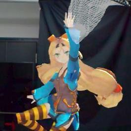
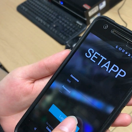

# Interests and Skills

# Projects

<link rel="stylesheet" href="https://cdn.rawgit.com/konpa/devicon/df6431e323547add1b4cf45992913f15286456d3/devicon.min.css">

    

        <!-- <class = "album_image">  -->
            
        <!-- 
 -->
        <h3>Kuroko Paradigm</h3>
        
 <i class="devicon-csharp-plain">  Unity3D </i><i class="devicon-cplusplus-plain"> Microsoft Hololens</i>

        
This research project aims to increase users' engagement while interacting with AR avatars. We introduced 'Reality Actuators' which handles physical objects triggered by the users during an interaction.

    

    

            

                
            

        <h3>Setapp</h3>
        
<i class="devicon-javascript-plain"> Javascript </i><i class="devicon-android-plain"> Android </i><i class="devicon-c-plain"> Particle Photon</i>

        
This is an IoT project which turns an ordinary lab into a smart lab. Users are able to control and monitor devices in the lab via apps on smartphones.

    

</>
